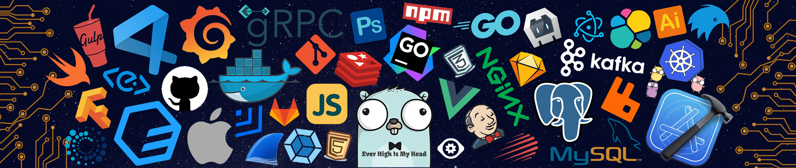

  

###

  
  
  
  
  
  
  

###

 

  

###

 

<h1 align="left">Hey there !👋</h1>

###

<h4 align="left">I’m Dip , a passionate MERN Stack Developer with an emerging passion for DevOps and a strong problem-solving mindset in algorithmic challenges. I have hands-on experience in developing full-stack web applications using MongoDB, Express.js, React.js, and Node.js, and I constantly push myself to learn new technologies and improve my skillset.</h4>

###

<h2 align="left">Skills & Interests :</h2>

###

<h4 align="left">🚀 MERN Stack Development – Proficient in NextJs, React, Node.js, Express.js, MongoDB, REST APIs. 💻 Competitive Programming – Active on Codeforces  solving algorithmic challenges. ☁️ DevOps Enthusiast – Learning Docker, CI/CD pipelines, cloud deployment strategies. 🖥️ Programming Languages – C, C++, JavaScript.</h4>

###

<h2 align="left">🛠 Language and tools</h2>

###

 

  
  
  
  
  
  
  
  
  
  
  
  
  
  
  
  
  
  
  
  
  
  
  
  
  
  
  
  
  
  
  
  
  
  
  
  
  
  
  
  
  
  
  
  
  

###

<h3 align="left">🔥   My Stats :</h3>

###

  
  

###

